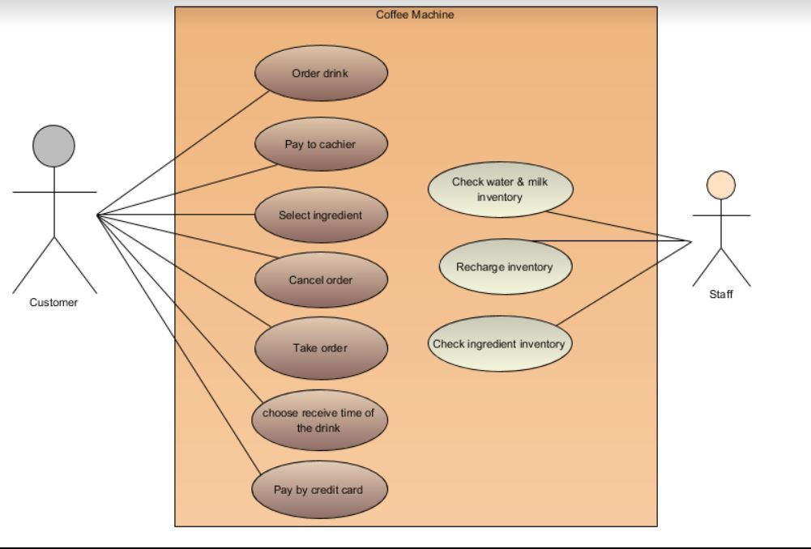
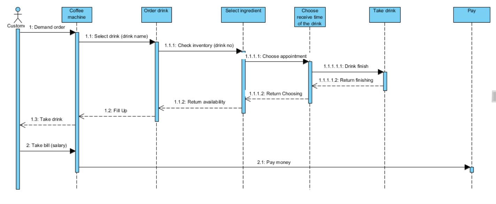
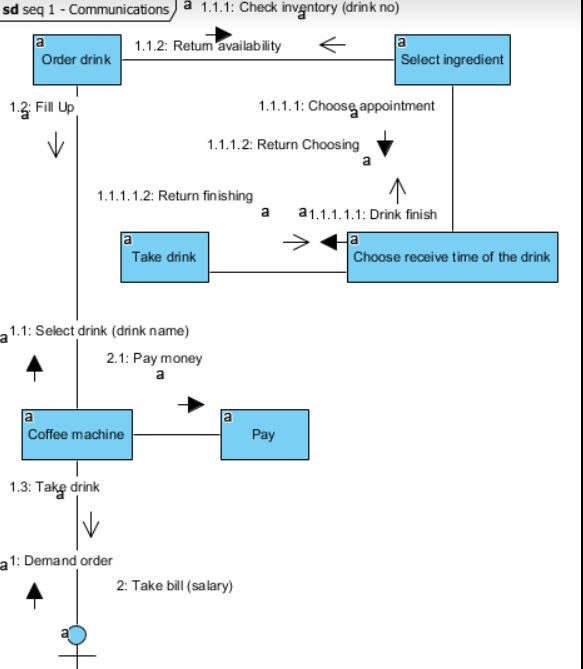
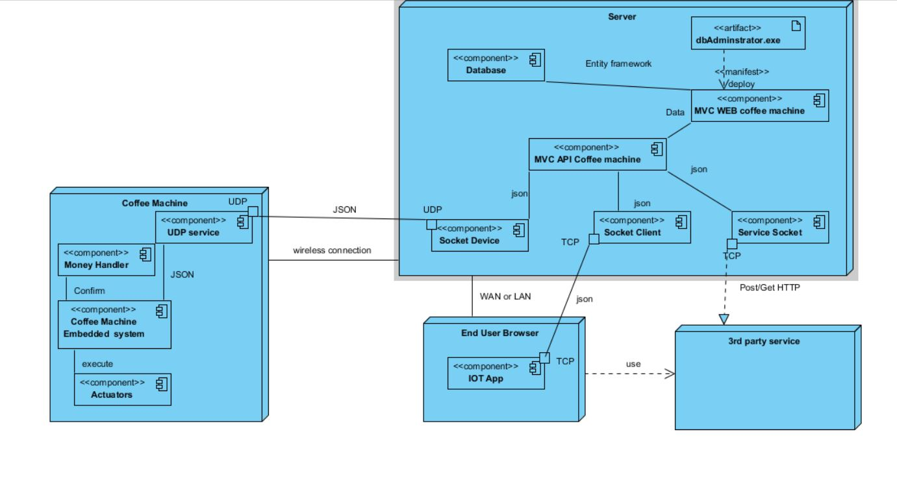
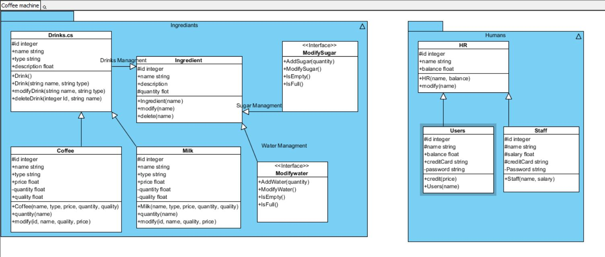
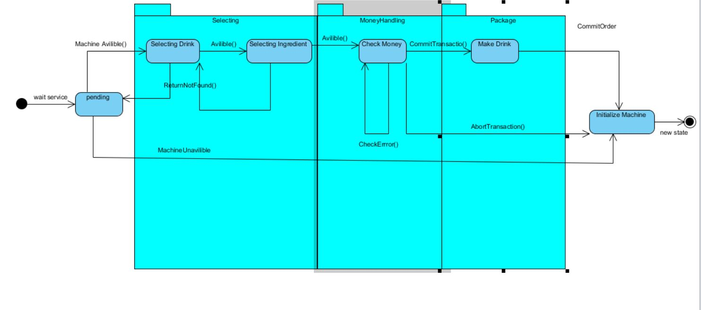
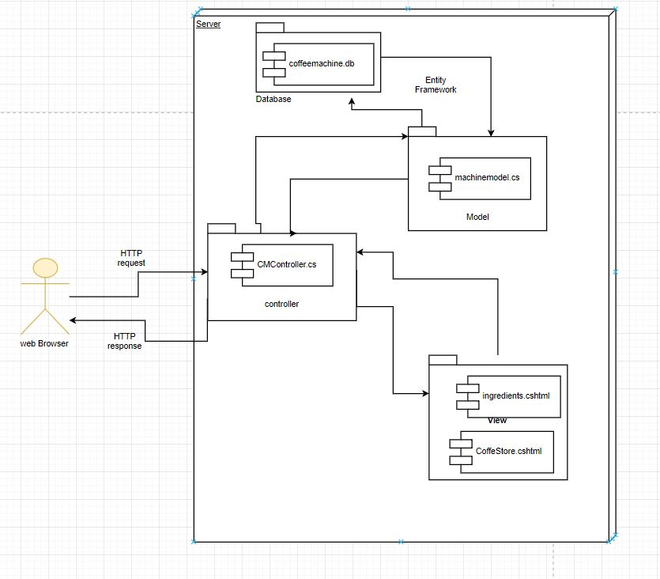
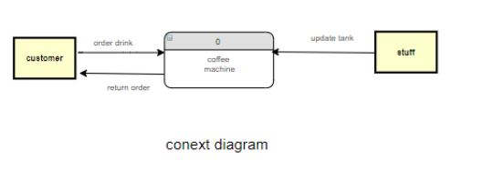
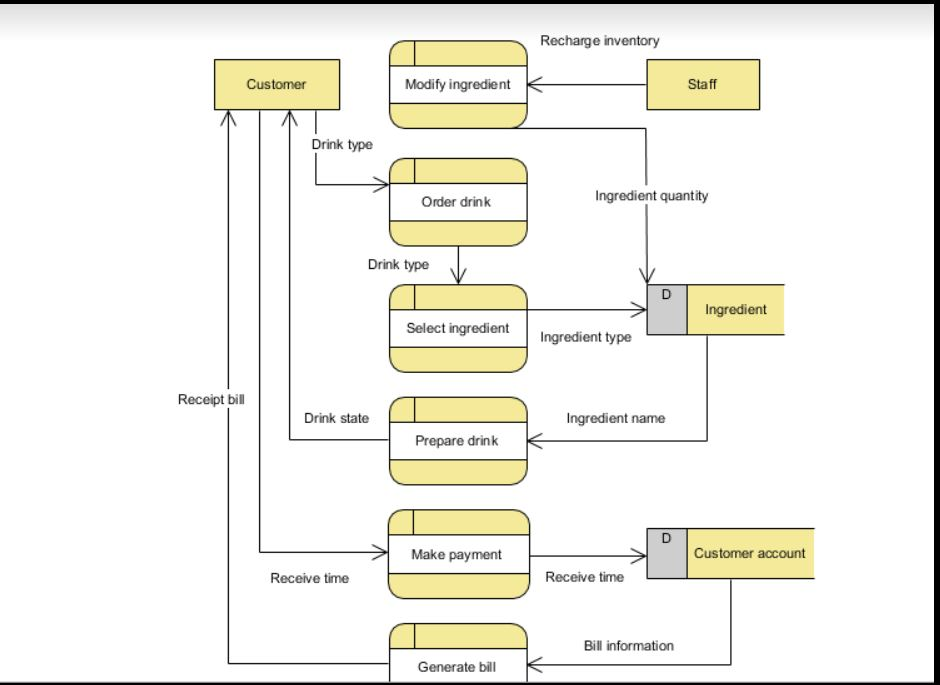

# Coffee_IOT_Machine_Analysis-master
## In The Name Of ALLAH
---
- **__Team  CIS Faculty__**
 - __Ahmed Abu Zahrah__
 - __Rana Hesham__
 - __Noura Abd Elnaser__
 - __Heba Ismail__
 - __Islam Khater__
 - __Ahmed Khalil__
 - __Merna Osama__
 - __Ibrahim El_Nagar__
  
---

## UMLS : Unified Modeling Language Models

 - ### USE CASE by  © __Rana Hesham__  Designed By  © __Heba Ismail__
   - 
 - ### Sequence & Collaboration © __Rana Hesham__  Designed By  © __Heba Ismail__
   - 
   - 
 - ### Activity by © __Ahmed Abu Zahrah__ & © __Rana Hesham__ Designed by © __Heba Ismail__
 - ### Component + Deployment by © __Ahmed Khalil__
   - 
 - ### Class by © __Ahmed Khalil__
   - 
 - ### StateChart by © __Islam Khater__   © __Ahmed Khalil__ Designed by © __Ahmed Khalil__
   - 
 - ### MVC Architecture by  © __Ahmed Khalil__ 
   - 

 
 
## Business Modeling 
 
 - ### DFD Level 1 Created by © __Noura Abd Elnaser__  & © __Rana Hesham__  Designed By  © __Heba Ismail__
   - 
   - 
 

